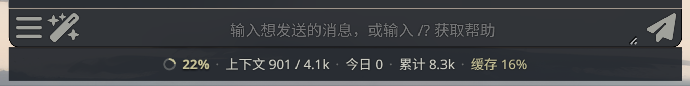
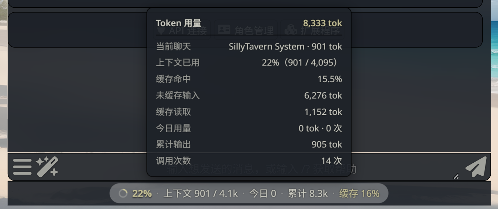
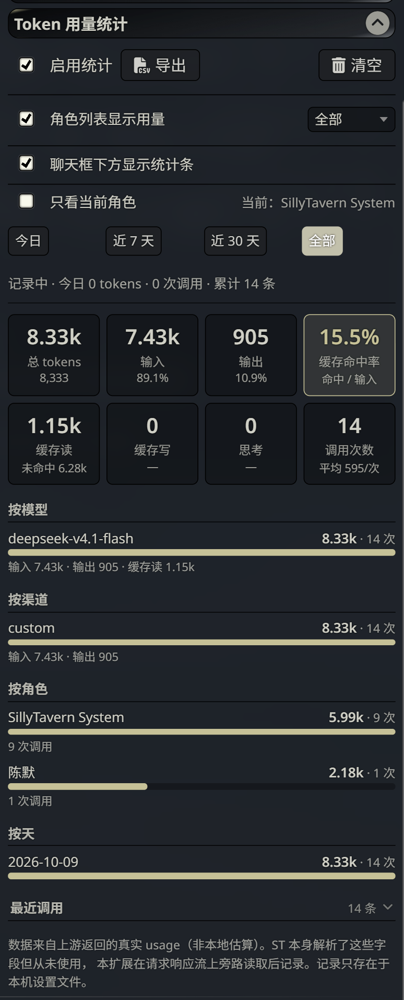
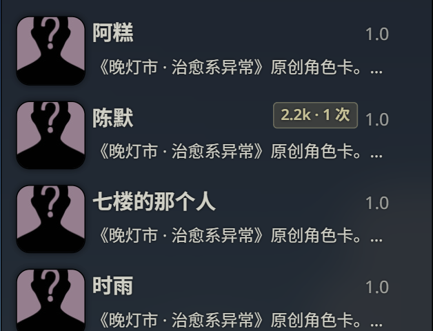
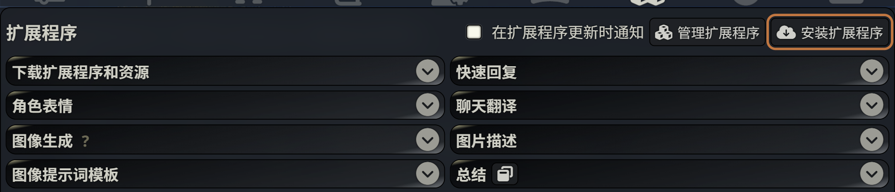
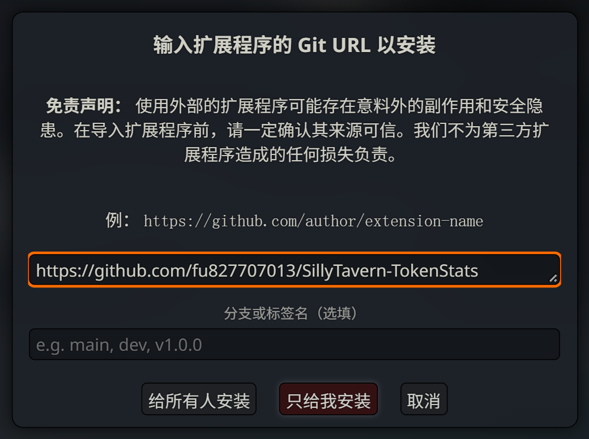
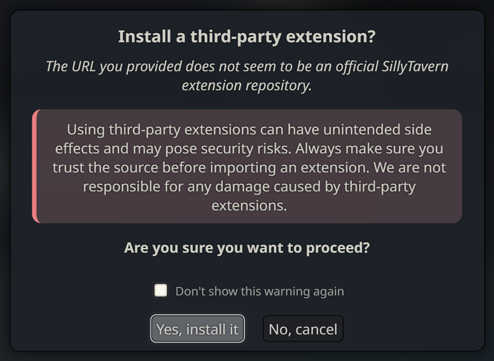
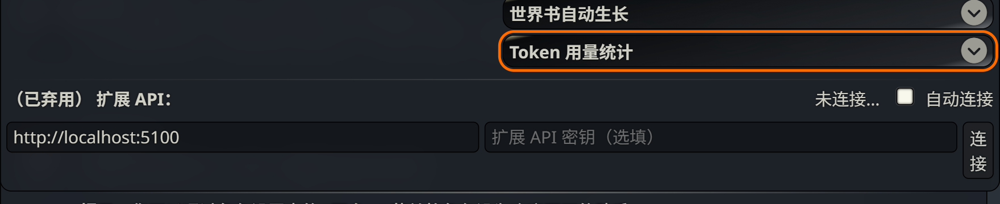

# Token 用量统计（SillyTavern 扩展）

在酒馆里实时统计 token 用量 —— **数据来自上游返回的真实 `usage`，不是本地字符估算**。


输入框下方常驻一条实时统计，鼠标悬浮展开明细：





设置面板里的完整统计：



每个角色的用量直接标在角色列表里：



## 它解决什么问题

酒馆前端其实**拿到了**每次请求的真实 token 用量，但从不使用：

- `public/scripts/openai.js:3175` 把每个 SSE chunk 都 `JSON.parse` 了，`parsed.usage` 就在手边
- 但整个前端**没有任何一处读取它** —— 数据到手就被丢弃

结果是：你在别的客户端（如 DSH）能看到精确用量，在酒馆里却看不到。

本扩展在请求响应流上旁路读取，把这份被丢掉的数据记录下来并可视化。

## 功能

- **精确统计**：输入 / 输出 / 合计 / 缓存读 / 缓存写 / 思考 token
- **8 个指标卡**：另含缓存命中率、调用次数、平均每次用量
- **4 个分组维度**：按模型、按渠道、**按角色**、按天
- **明细表**：最近 25 次调用逐条可查
- **时间范围**：今日 / 近 7 天 / 近 30 天 / 全部，**会记住你的选择**
- **CSV 导出**：当前范围一键导出，Excel 打开不乱码
- **自动持久化**：记录存在酒馆设置里，刷新页面不丢
- **异常可见**：上游没返回 usage 时明确提示，不让你误以为坏了
- **不干扰原功能**：旁路克隆响应流，不影响酒馆自身消费

## 兼容性

实测上游返回的 usage 字段（以 DeepSeek 系模型为例）：

```json
{
  "prompt_tokens": 15,
  "completion_tokens": 1,
  "total_tokens": 16,
  "prompt_cache_hit_tokens": 0,
  "prompt_cache_miss_tokens": 15,
  "cache_read_input_tokens": 0,
  "cache_creation_input_tokens": 0,
  "completion_thinking_tokens": 0
}
```

同时兼容 OpenAI 格式的 `cached_tokens` / `reasoning_tokens` 字段名。

### 缓存命中率是怎么算的（重要）

上游的三个字段满足这个关系：

```
prompt_tokens = prompt_cache_hit_tokens + prompt_cache_miss_tokens
```

也就是说，**`prompt_tokens` 本身已经包含命中的部分**。
命中率 = `prompt_cache_hit_tokens / prompt_tokens`。

> 这一点用真实请求验证过：同一段长前缀连续请求两次，
> 两次 `prompt_tokens` 都是 1287，第一次 `hit=0`，第二次 `hit=1152`。
> 命中率 = 1152/1287 = **89.5%**。
> 如果把分母写成 `hit + prompt` 会算成 47.2% —— 少一半，这是本扩展 v1.0.0 的真实 bug，v1.1.0 已修。

> **注意**：上游必须返回 `usage` 才有数据。部分第三方网关会省略该字段。
> 遇到这种情况，状态栏会显示「⚠ N 次未返回用量」，而不是让你误以为插件坏了。

## 安装

### 方式一：酒馆内一键安装（推荐）

**第 1 步** — 打开酒馆，点顶部**积木图标（扩展程序）**，在面板右上角找到并点击 **「安装扩展程序」**：



> ⚠️ 注意：面板下方那个 `http://localhost:5100` 输入框是**已弃用的扩展 API 地址**，**不是**安装用的。
> 必须点上图中高亮的「安装扩展程序」按钮。

**第 2 步** — 会弹出对话框，在输入框里粘贴本仓库地址，然后点 **「只给我安装」**：



```
https://github.com/fu827707013/SillyTavern-TokenStats
```

- **只给我安装** → 装到 `data/<用户名>/extensions/`（个人使用，推荐）
- **给所有人安装** → 装到 `public/scripts/extensions/third-party/`（需管理员权限）

> 「分支或标签名」留空即可，默认拉 `main`。

**第 3 步** — 会弹出**第三方扩展警告**（提示这不是官方扩展），点 **「Yes, install it」** 确认：



**第 4 步** — 刷新页面（F5）。扩展列表里出现 **「Token 用量统计」** 就装好了：



> **安装耗时说明**：酒馆要从 GitHub 克隆仓库，网络慢时前端可能显示请求超时，但**服务端通常已经装好了**。
> 先刷新页面看看，不要急着重试。若重试时提示 `Directory already exists`，说明上次已成功。

> 以上截图是**实际走完整个流程**逐帧截取的（2026-10-10，SillyTavern 1.19.0），
> 不是示意图 —— 按钮位置和文案与你看到的完全一致。

### 方式二：手动复制

把本仓库所有文件放进：

```
SillyTavern/public/scripts/extensions/third-party/token-stats/
```

**关键**：`index.js` 必须和 `manifest.json` **在同一层**。多套一层同名文件夹会导致酒馆静默不加载。

> 注意：从 GitHub 安装时，酒馆用**仓库名**当文件夹名，所以实际目录是
> `SillyTavern-TokenStats/`，而不是手工复制时的 `token-stats/`。插件已做兼容，两种名字都能正常工作。

## 使用

安装后刷新页面，点顶部**积木图标** → 找到「Token 用量统计」面板。

- 正常聊天，用量自动记录
- 点「今日 / 近 7 天 / 近 30 天 / 全部」切换统计范围（**会记住上次的选择**）
- **导出**：把当前范围的记录导出成 CSV，Excel 可直接打开（带 BOM，中文不乱码）
- 关掉「启用统计」会停止记录新调用，**历史数据保留**
- 「清空」按钮删除全部历史记录（会先弹确认框，并告诉你要删多少条）
- **最近调用默认折叠** —— 点标题栏展开/收起，不会把面板拉得很长（状态也会记住）
- **角色列表显示用量** —— 见下
- **只看当前角色** —— 见下

### 输入框下方的实时统计条

输入框下方常驻一条紧凑的统计，形如：

```
◐ 22% · 上下文 901 / 4.1k · 今日 8.3k · 累计 8.3k · 缓存 16%
```

- **环形进度 + 百分比** = 当前上下文占用（`最近一次请求的真实 prompt_tokens / 模型上下文窗口`）
- 分母取自酒馆自己的 `getMaxContextTokens()`，跟随你设置的上下文大小
- **只统计当前聊天** —— 切到别的角色会重新开始计数，不会显示上一个聊天的读数
  （当前聊天还没聊过时显示 `上下文 —`，而不是伪造成 0）
- 发消息后**自动更新**，不用刷新
- **鼠标悬浮即展开明细面板**（不需要点击）：
  当前聊天 / 上下文已用 / 缓存命中 / 未缓存输入 / 缓存读取 / 今日用量 / 累计输出 / 调用次数
- 鼠标移开自动收起；**点一下可以钉住**（方便对着数字看或复制），再点取消
- 按 `Esc` 或点面板外也能收起
- 窗口变窄时按 **缓存 → 累计 → 今日 → 上下文** 的顺序依次收起，不会撑破输入区
- 不想看可以在扩展面板里关掉（「聊天框下方显示统计条」）

> 位置与交互对齐 DSH 的 ContextMeter（`packages/client/ui-conversation/src/client/skeleton/ContextMeter.tsx`）：
> 同样在输入区下方、环形进度 + 百分比、悬浮展开明细。
> 区别是这个版本额外带了今日/累计/缓存三档速览，并且能只统计当前角色。

### 只看当前角色

多角色剧本时，如果只想看**当前这个角色**花了多少：

勾选设置面板里的「**只看当前角色**」，此时：

- 8 个指标卡、按模型/渠道/天、最近调用 —— **全部只统计当前角色**
- 右侧会显示「当前：角色名」，一眼知道作用于谁
- 导出 CSV 也跟随这个过滤（看到的和导出的永远一致）
- 当前角色在该时间段没有记录时，会明确告诉你换范围而不是显示空白

> 群聊也支持：按「会话」归并，同一次群聊里所有角色的发言算在一起（因为上下文是共享的）。

### 在角色列表里看到每个角色的用量

打开右侧**角色管理**面板，聊过的角色名后面会跟一个紧凑徽章：


上例中「陈默」后面的 `2.2k · 1 次` 就是这个角色的累计用量。

- 鼠标悬停看完整信息（累计 tokens、调用次数、统计范围）
- 统计范围可在扩展面板里选（默认「全部」）
- 没聊过的角色不显示徽章，不会污染列表
- 不想看可以在扩展面板里**关掉**（「角色列表显示用量」勾选框）

**群聊也支持**：群聊里每个角色的发言会分别记到各自名下，徽章上看到的就是「这个角色累计消耗了多少」。

> 实现说明：徽章通过 `MutationObserver` 监听角色列表重绘后补上，**不改酒馆源码**，
> 翻页 / 搜索 / 改每页数量都能正常工作。

### 面板上能看到什么


**8 个指标卡**：总 tokens、输入、输出、**缓存命中率**（独立成卡，强调色描边）、缓存读（附未命中量）、缓存写、思考、调用次数（附平均每次）

> 缓存命中率 = `prompt_cache_hit_tokens / prompt_tokens`，与「缓存读」不重复显示数字：
> 命中率卡告诉你比例，缓存读卡告诉你命中量与未命中量。

**4 个分组维度**：
- 按模型 —— 哪个模型最费
- 按渠道 —— 换过 API 的话能对比
- 按角色 —— 哪个角色的会话最费
- 按天 —— 用量趋势（「全部」范围不限制天数）

**最近调用明细**：时间 / 模型 / 输入 / 输出 / 合计，最多 25 条

### 控制台自查

```js
window.tokenStats.diagnose()
// 一键自检：拦截器、面板、数据链路、缓存命中率，全部一次看清

window.tokenStats.summary('today')
// → { prompt, completion, total, cacheRead, cacheWrite, reasoning, calls, cacheMiss }

window.tokenStats.records()      // 全部原始记录
window.tokenStats.export()       // 导出 CSV（同面板按钮）
window.tokenStats.clear()        // 清空
window.tokenStats.resetMissed()  // 把「未返回用量」计数归零
```

## 它怎么工作的

1. 包装 `window.fetch`，只拦截 `/api/backends/chat-completions/generate`（酒馆聊天补全的唯一出站请求）
2. 克隆响应流**旁路**读取 —— 酒馆自己仍消费原始流，互不影响
3. 逐行解析 SSE（`data: {...}`），取最后一个非空 `usage`
4. 归一化字段后写入 `extension_settings['token-stats'].records`

**不依赖 `content-type` 判断**：实测部分网关的流式响应不带该响应头，按响应头判断会解析失败。

## 版本历史

- **v1.1.1** —— 界面与交互修复：
  **统计条移到输入框下方**、改为**鼠标悬浮展开**（对齐 DSH 布局），点一下可钉住；
  修复统计条**没有背景**导致文字压在壁纸上完全看不清（实测对比度拉到 10.29:1）；
  全量文字对比度达标 **WCAG AA**，字号 12px → 13px；
  徽章补 `opacity:1` 覆盖酒馆全局 `small{opacity:.7}`，字号 9.3px → 10.8px；
  刷新（发消息/切换聊天）**不再打断悬浮或钉住**状态；
  点进输入框自动收起面板，避免遮住正在输入的内容；
  README 补充界面截图
- **v1.1.0** —— 修复缓存命中率计算错误（分母重复计算，实测 89.5% 被算成 47.2%）；
  新增 CSV 导出、按角色分组、缓存写/思考/平均每次指标、`diagnose()` 自检、范围记忆；
  清空改用酒馆原生弹窗；非 2xx 响应不再计入统计；防重复注入面板；
  「最近调用」可折叠；缓存命中率独立成卡；
  **角色列表用量徽章**（含群聊按角色归属）；
  修复群聊中角色名归属时序（改为在请求发出瞬间取角色名，而非读完响应流之后）；
  **实时统计条**（环形进度 + 上下文占用，参考 DSH ContextMeter）；
  **只看当前角色**过滤；上下文读数按会话隔离（不再跨聊天串味）；
  空状态提示最近记录时间；统计条响应式逐级收起
- **v1.0.0** —— 首个版本

## 已知限制

- 只统计聊天补全，不含图片生成等其他请求
- 记录上限 3000 条（超出后丢弃最早的），约占用酒馆设置文件 480 KB
- 不计算费用金额 —— 各家计价规则不同，强行换算会误导
- 统计条展开的明细面板会盖住输入框中部（与 DSH 一致）；
  点进输入框会自动收起，不会挡着打字

## 许可

MIT

## 版本

1.1.1 — 基于 SillyTavern 1.19.0 实测开发
